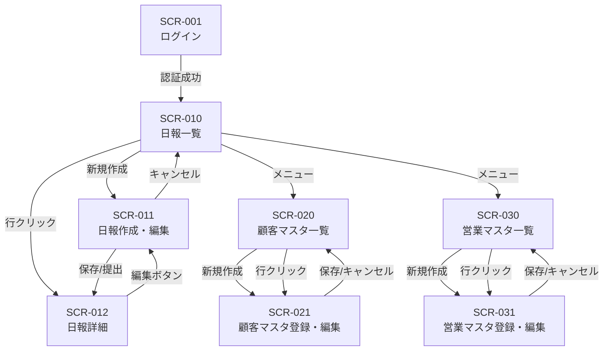

# 営業日報システム 画面定義書

## 画面一覧

| #   | 画面ID  | 画面名               | 概要                             | 利用者     |
| --- | ------- | -------------------- | -------------------------------- | ---------- |
| 1   | SCR-001 | ログイン             | メールアドレス・パスワードで認証 | 全員       |
| 2   | SCR-010 | 日報一覧             | 自分または部下の日報を一覧表示   | 営業・上長 |
| 3   | SCR-011 | 日報作成・編集       | 訪問記録・Problem・Planを入力    | 営業       |
| 4   | SCR-012 | 日報詳細             | 日報の閲覧とコメント投稿         | 営業・上長 |
| 5   | SCR-020 | 顧客マスタ一覧       | 顧客の検索・一覧表示             | 営業・上長 |
| 6   | SCR-021 | 顧客マスタ登録・編集 | 顧客情報の登録・編集             | 営業・上長 |
| 7   | SCR-030 | 営業マスタ一覧       | 営業担当者の一覧表示             | 上長       |
| 8   | SCR-031 | 営業マスタ登録・編集 | 営業担当者の登録・編集           | 上長       |

## 画面遷移図



---

## SCR-001: ログイン

### 概要

システムにログインするための認証画面。

### レイアウト

```
+------------------------------------------+
|           営業日報システム                  |
|                                          |
|  メールアドレス: [___________________]    |
|  パスワード:     [___________________]    |
|                                          |
|            [ ログイン ]                   |
|                                          |
|  エラーメッセージ表示エリア                |
+------------------------------------------+
```

### 入力項目

| #   | 項目名         | 種別       | 必須 | 備考             |
| --- | -------------- | ---------- | ---- | ---------------- |
| 1   | メールアドレス | テキスト   | o    | 形式チェックあり |
| 2   | パスワード     | パスワード | o    | マスク表示       |

### アクション

| ボタン   | 動作                                            |
| -------- | ----------------------------------------------- |
| ログイン | 認証処理を実行。成功時は日報一覧(SCR-010)へ遷移 |

---

## SCR-010: 日報一覧

### 概要

自分の日報一覧を表示する。上長の場合は部下の日報も閲覧可能。

### レイアウト

```
+----------------------------------------------------------+
| [メニュー]                    営業日報システム  [ログアウト] |
+----------------------------------------------------------+
| 日報一覧                                                  |
|                                                          |
| 検索条件:                                                 |
|  報告日: [____] 〜 [____]  担当者: [▼選択]  [検索]        |
|                                                          |
|                                    [ + 新規作成 ]         |
| +------+------------+----------+--------+------+         |
| | 報告日 | 担当者    | 訪問件数  | ステータス | 操作 |         |
| +------+------------+----------+--------+------+         |
| | 04/04 | 田中太郎   | 3件      | 提出済   | 詳細 |         |
| | 04/03 | 田中太郎   | 2件      | 提出済   | 詳細 |         |
| | 04/02 | 田中太郎   | 1件      | 下書き   | 詳細 |         |
| +------+------------+----------+--------+------+         |
|                                                          |
| < 1 2 3 ... >  (ページネーション)                          |
+----------------------------------------------------------+
```

### 検索条件

| #   | 項目名             | 種別       | 備考                               |
| --- | ------------------ | ---------- | ---------------------------------- |
| 1   | 報告日（FROM〜TO） | 日付       | デフォルト：当月                   |
| 2   | 担当者             | プルダウン | 上長の場合のみ表示。部下を選択可能 |

### 一覧表示項目

| #   | 項目名     | 備考                |
| --- | ---------- | ------------------- |
| 1   | 報告日     | yyyy/MM/dd          |
| 2   | 担当者名   |                     |
| 3   | 訪問件数   | visit_record の件数 |
| 4   | ステータス | 下書き / 提出済     |
| 5   | 操作       | 詳細リンク          |

### アクション

| ボタン   | 動作                           |
| -------- | ------------------------------ |
| 新規作成 | 日報作成画面(SCR-011)へ遷移    |
| 詳細     | 日報詳細画面(SCR-012)へ遷移    |
| 検索     | 条件に合致する日報を検索・表示 |

---

## SCR-011: 日報作成・編集

### 概要

訪問記録・Problem・Planを入力して日報を作成・編集する画面。

### レイアウト

```
+----------------------------------------------------------+
| [← 戻る]                     日報作成          [ログアウト] |
+----------------------------------------------------------+
|                                                          |
| 報告日: [2026/04/04]                                      |
|                                                          |
| ■ 訪問記録                                [ + 行追加 ]    |
| +----+----------+--------+------------------+---------+  |
| | #  | 訪問時刻  | 顧客名  | 訪問内容          | 操作    |  |
| +----+----------+--------+------------------+---------+  |
| | 1  | [09:00]  | [▼選択] | [_______________] | [削除]  |  |
| | 2  | [11:00]  | [▼選択] | [_______________] | [削除]  |  |
| | 3  | [14:00]  | [▼選択] | [_______________] | [削除]  |  |
| +----+----------+--------+------------------+---------+  |
|                                                          |
| ■ Problem（課題・相談）                                    |
| +------------------------------------------------------+ |
| |                                                      | |
| | (テキストエリア)                                       | |
| |                                                      | |
| +------------------------------------------------------+ |
|                                                          |
| ■ Plan（明日やること）                                     |
| +------------------------------------------------------+ |
| |                                                      | |
| | (テキストエリア)                                       | |
| |                                                      | |
| +------------------------------------------------------+ |
|                                                          |
|              [ 下書き保存 ]    [ 提出 ]                    |
+----------------------------------------------------------+
```

### 入力項目

| #   | 項目名 | 種別 | 必須 | 備考             |
| --- | ------ | ---- | ---- | ---------------- |
| 1   | 報告日 | 日付 | o    | デフォルト：本日 |

#### 訪問記録（複数行）

| #   | 項目名   | 種別           | 必須 | 備考               |
| --- | -------- | -------------- | ---- | ------------------ |
| 1   | 訪問時刻 | 時刻           | o    | HH:mm              |
| 2   | 顧客名   | プルダウン     | o    | 顧客マスタから選択 |
| 3   | 訪問内容 | テキストエリア | o    | 自由記述           |

#### Problem・Plan

| #   | 項目名  | 種別           | 必須 | 備考           |
| --- | ------- | -------------- | ---- | -------------- |
| 1   | Problem | テキストエリア | -    | 課題・相談事項 |
| 2   | Plan    | テキストエリア | -    | 明日やること   |

### アクション

| ボタン     | 動作                                            |
| ---------- | ----------------------------------------------- |
| 行追加     | 訪問記録の行を1行追加                           |
| 削除       | 対象行を削除（確認ダイアログあり）              |
| 下書き保存 | ステータス「下書き」で保存。一覧(SCR-010)へ遷移 |
| 提出       | ステータス「提出済」で保存。詳細(SCR-012)へ遷移 |
| 戻る       | 変更破棄の確認後、一覧(SCR-010)へ遷移           |

### バリデーション

- 訪問記録は最低1行必要（提出時）
- 同一顧客を複数行で選択可能（同日に複数回訪問するケース）
- 同一日付の日報が既に存在する場合はエラー（新規作成時）

---

## SCR-012: 日報詳細

### 概要

提出された日報の閲覧画面。上長はコメントを投稿できる。

### レイアウト

```
+----------------------------------------------------------+
| [← 一覧へ]                   日報詳細          [ログアウト] |
+----------------------------------------------------------+
|                                                          |
| 報告日: 2026/04/04    担当者: 田中太郎    ステータス: 提出済 |
|                                                          |
| ■ 訪問記録                                                |
| +----+--------+----------+-----------------------------+ |
| | #  | 時刻   | 顧客名    | 訪問内容                     | |
| +----+--------+----------+-----------------------------+ |
| | 1  | 09:00  | A商事    | 新規提案の打合せ。見積依頼あり  | |
| | 2  | 11:00  | B工業    | 定期フォロー。次回は来月予定   | |
| | 3  | 14:00  | C物産    | クレーム対応。詳細は別途報告   | |
| +----+--------+----------+-----------------------------+ |
|                                                          |
| ■ Problem（課題・相談）                                    |
| +------------------------------------------------------+ |
| | A商事の見積について、特別値引きの承認が必要。            | |
| +------------------------------------------------------+ |
|                                                          |
| ■ Plan（明日やること）                                     |
| +------------------------------------------------------+ |
| | A商事への見積作成、B工業への議事録送付                   | |
| +------------------------------------------------------+ |
|                                                          |
| ■ コメント                                                |
| +------------------------------------------------------+ |
| | 鈴木部長 (2026/04/04 18:30)                           | |
| | A商事の値引きは10%まで承認します。見積を確認させて      | |
| | ください。                                             | |
| +------------------------------------------------------+ |
| | 鈴木部長 (2026/04/04 19:00)                           | |
| | B工業の件、来月訪問時に新製品の紹介もお願いします。     | |
| +------------------------------------------------------+ |
|                                                          |
| コメント入力:  ※上長のみ表示                               |
| +------------------------------------------------------+ |
| | (テキストエリア)                                       | |
| +------------------------------------------------------+ |
|                           [ コメント投稿 ]                 |
|                                                          |
|              [ 編集 ]  ※本人かつ下書き時のみ               |
+----------------------------------------------------------+
```

### 表示項目

| #   | 項目名       | 備考                   |
| --- | ------------ | ---------------------- |
| 1   | 報告日       | yyyy/MM/dd             |
| 2   | 担当者名     |                        |
| 3   | ステータス   | 下書き / 提出済        |
| 4   | 訪問記録一覧 | 時刻・顧客名・訪問内容 |
| 5   | Problem      | 課題・相談             |
| 6   | Plan         | 明日やること           |
| 7   | コメント一覧 | 投稿者名・日時・内容   |

### アクション

| ボタン       | 動作                         | 表示条件                       |
| ------------ | ---------------------------- | ------------------------------ |
| 編集         | 日報編集画面(SCR-011)へ遷移  | 本人かつステータスが「下書き」 |
| コメント投稿 | コメントを保存して画面を更新 | 上長のみ                       |
| 一覧へ       | 日報一覧(SCR-010)へ遷移      | 常時                           |

---

## SCR-020: 顧客マスタ一覧

### 概要

登録済み顧客の検索・一覧表示画面。

### レイアウト

```
+----------------------------------------------------------+
| [メニュー]                  顧客マスタ一覧      [ログアウト] |
+----------------------------------------------------------+
|                                                          |
| 検索: 顧客名 [_______________]  [検索]                    |
|                                                          |
|                                    [ + 新規登録 ]         |
| +----+----------+------------------+----------+--------+ |
| | ID | 顧客名    | 住所              | 電話番号  | ステータス| |
| +----+----------+------------------+----------+--------+ |
| | 1  | A商事    | 東京都千代田区...   | 03-xxxx  | 有効   | |
| | 2  | B工業    | 大阪府大阪市...     | 06-xxxx  | 有効   | |
| +----+----------+------------------+----------+--------+ |
+----------------------------------------------------------+
```

### アクション

| ボタン     | 動作                        |
| ---------- | --------------------------- |
| 新規登録   | 顧客登録画面(SCR-021)へ遷移 |
| 行クリック | 顧客編集画面(SCR-021)へ遷移 |

---

## SCR-021: 顧客マスタ登録・編集

### 概要

顧客情報の新規登録・編集画面。

### 入力項目

| #   | 項目名     | 種別             | 必須 | 備考             |
| --- | ---------- | ---------------- | ---- | ---------------- |
| 1   | 顧客名     | テキスト         | o    |                  |
| 2   | 住所       | テキスト         | -    |                  |
| 3   | 電話番号   | テキスト         | -    | 形式チェックあり |
| 4   | 有効フラグ | チェックボックス | -    | デフォルト：有効 |

### アクション

| ボタン     | 動作                                |
| ---------- | ----------------------------------- |
| 保存       | 顧客情報を保存。一覧(SCR-020)へ遷移 |
| キャンセル | 一覧(SCR-020)へ遷移                 |

---

## SCR-030: 営業マスタ一覧

### 概要

営業担当者の一覧表示画面。上長のみアクセス可能。

### 一覧表示項目

| #   | 項目名         | 備考        |
| --- | -------------- | ----------- |
| 1   | 氏名           |             |
| 2   | メールアドレス |             |
| 3   | 上長名         |             |
| 4   | ステータス     | 有効 / 無効 |

### アクション

| ボタン     | 動作                        |
| ---------- | --------------------------- |
| 新規登録   | 営業登録画面(SCR-031)へ遷移 |
| 行クリック | 営業編集画面(SCR-031)へ遷移 |

---

## SCR-031: 営業マスタ登録・編集

### 概要

営業担当者の新規登録・編集画面。

### 入力項目

| #   | 項目名         | 種別             | 必須 | 備考                   |
| --- | -------------- | ---------------- | ---- | ---------------------- |
| 1   | 氏名           | テキスト         | o    |                        |
| 2   | メールアドレス | テキスト         | o    | 一意制約・形式チェック |
| 3   | パスワード     | パスワード       | o    | 新規登録時のみ必須     |
| 4   | 上長           | プルダウン       | -    | 営業マスタから選択     |
| 5   | 有効フラグ     | チェックボックス | -    | デフォルト：有効       |

### アクション

| ボタン     | 動作                                      |
| ---------- | ----------------------------------------- |
| 保存       | 営業担当者情報を保存。一覧(SCR-030)へ遷移 |
| キャンセル | 一覧(SCR-030)へ遷移                       |
