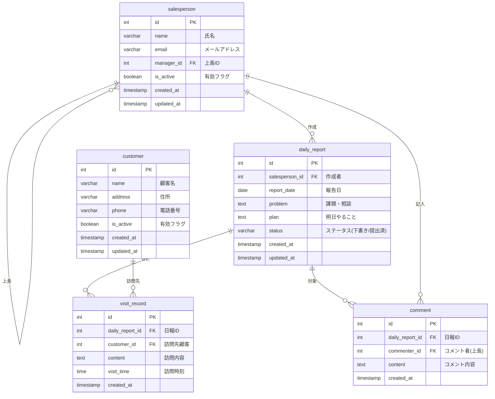

# 営業日報システム 要件定義

## 機能要件

| #   | 機能           | 説明                                                    |
| --- | -------------- | ------------------------------------------------------- |
| F1  | 日報作成       | 営業担当者が日次で日報を作成する                        |
| F2  | 訪問記録登録   | 1日報に対して複数の顧客訪問記録を登録できる             |
| F3  | 課題・予定登録 | Problem（課題・相談）とPlan（明日やること）を記入できる |
| F4  | 上長コメント   | 上長が課題・予定に対してコメントを付けられる            |
| F5  | 顧客マスタ管理 | 顧客情報の登録・編集・参照                              |
| F6  | 営業マスタ管理 | 営業担当者情報の登録・編集・参照（上長関係を含む）      |

## エンティティ一覧

| エンティティ             | 説明                                                  |
| ------------------------ | ----------------------------------------------------- |
| 営業担当者 (salesperson) | 営業スタッフ。上長もこのテーブルで管理（自己参照）    |
| 顧客 (customer)          | 訪問先の顧客                                          |
| 日報 (daily_report)      | 営業担当者が1日1件作成する報告書。Problem・Planを含む |
| 訪問記録 (visit_record)  | 日報に紐づく顧客訪問の詳細（複数件）                  |
| コメント (comment)       | 上長が日報のProblem・Planに対して付けるコメント       |

## ER図

## 設計ポイント

- **営業担当者の上長関係**: `manager_id` の自己参照で表現。上長もコメント者として同じテーブルから参照される
- **訪問記録**: 日報と顧客の間の中間テーブルとして機能し、訪問内容を保持
- **Problem / Plan**: `daily_report` テーブルのカラムとして保持。1日報に対してそれぞれ1件
- **コメント**: 日報全体（Problem・Plan両方）に対して付けるコメント
